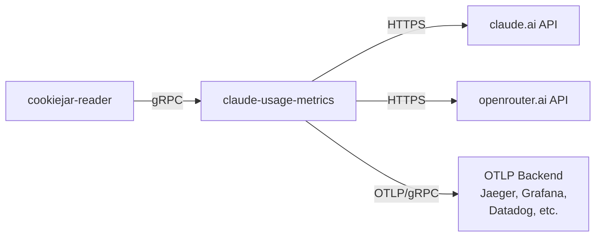

# claude-usage-metrics

A Rust application that collects Claude API usage metrics and OpenRouter credits information, then exports them via OpenTelemetry (OTLP).

## Overview

This tool fetches usage statistics from Claude AI and credit information from OpenRouter, exposing them as OpenTelemetry metrics for monitoring and observability. It retrieves authentication cookies from a separate cookiejar-reader service via gRPC for Claude API access, and uses API key authentication for OpenRouter.

## Architecture



## Features

- Fetches Claude usage data including:
  - 5-hour usage window
  - 7-day usage window
  - 7-day Opus usage
  - 7-day Sonnet usage
  - Extra usage
- Records utilization rate (0.0-1.0) and seconds until reset
- Fetches OpenRouter credits information:
  - Total credits purchased
  - Total credits used
  - Remaining credits
- Parallel data collection from both services
- Exports metrics via OpenTelemetry/OTLP to any compatible backend

## Environment Variables

| Variable | Description | Example |
|----------|-------------|---------|
| `COOKIEJAR_URL` | gRPC endpoint for cookiejar-reader service | `http://cookiejar-reader:50051` |
| `CLAUDE_ORGANIZATION_ID` | Your Claude organization ID | `10cdca09-edfe-4888-a41a-86d694683d38` |
| `OTEL_EXPORTER_OTLP_ENDPOINT` | OpenTelemetry OTLP gRPC endpoint | `http://localhost:4317` |
| `OTEL_SERVICE_NAME` | Service name for telemetry | `claude-usage-metrics` |
| `OPENROUTER_API_KEY` | OpenRouter API key for credits endpoint | `sk-or-v1-...` |

## Usage

### Local Development

1. Copy `.env.example` to `.env` and configure the environment variables
2. Start an OTLP-compatible backend (e.g., Jaeger):
   ```bash
   docker compose up -d
   ```
3. Run the application:
   ```bash
   dotenvx run -f ./.env -- cargo run
   ```

### Docker

Build and run with Docker:

```bash
docker build -t claude-usage-metrics .
docker run --env-file .env claude-usage-metrics
```

## Metrics

The following metrics are exported:

### Claude Metrics

| Metric Name | Type | Description |
|-------------|------|-------------|
| `claude.usage.utilization` | Gauge (f64) | Usage rate from 0.0 to 1.0 |
| `claude.usage.seconds_to_reset` | Gauge (i64) | Seconds until the usage window resets |

Each Claude metric includes a `metric_name` attribute to identify the usage type:
- `five_hour`
- `seven_day`
- `seven_day_opus`
- `seven_day_sonnet`
- `seven_day_oauth_apps`
- `iguana_necktie`
- `extra_usage`

### OpenRouter Metrics

| Metric Name | Type | Unit | Description |
|-------------|------|------|-------------|
| `openrouter.credits.total` | Gauge (f64) | USD | Total credits purchased |
| `openrouter.credits.usage` | Gauge (f64) | USD | Total credits used |
| `openrouter.credits.remaining` | Gauge (f64) | USD | Remaining credits (total - usage) |

## Development

### Prerequisites

- Rust 1.92+
- An OTLP-compatible backend (e.g., Jaeger, Grafana, Datadog)

### Running Tests

```bash
cargo test
```

### Building

```bash
cargo build --release
```

### Viewing Metrics

View metrics in your OTLP backend. For example, with Jaeger:

1. Start Jaeger with `docker compose up -d`
2. Open the Jaeger UI at http://localhost:16686
3. Select the service name configured in `OTEL_SERVICE_NAME`

## License

MIT
